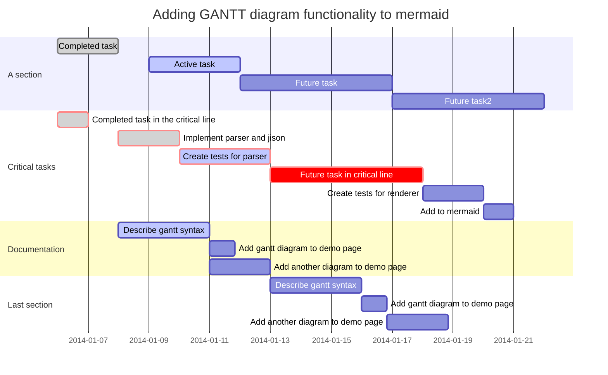

```sequence
Alice->Bob: hello bob,how are you?
Note right of Bob:Bob thinks
Bob-->Alice:I am good thanks!
```

```css
import QtQuick 2.0
import QtQuick.Controls 1.4

Item {
    Column {
          CheckBox {
              text: qsTr("Brealkjkfast")
              checked: true
          }
          CheckBox {
              text: qsTr("Lulkjnch")
          }
          CheckBox {
              text: qsTr("Brealkk
```



```html
<table>
    <tr>
        <th>设备</th>
        <th>设备文件名</th>
        <th>文件描述符</th>
        <th>类型</th>
    </tr>
    <tr>
        <th>键盘</th>
        <th>/dev/stdin</th>
        <th>0</th>
        <th>标准输入</th>
    </tr>
    <tr>
        <th>显示器</th>
        <th>/dev/stdout</th>
        <th>1</th>
        <th>标准输出</th>
    </tr>
    <tr>
        <th>显示器</th>
        <th>/dev/stderr</th>
        <th>2</th>
        <th>标准错误输出</th>
    </tr>
</table>
```

| Name             |  Academy   | score |
| :--------------- | :--------: | ----: |
| Harry Potter     | Gryffindor |    90 |
| Hermione Granger | Gryffindor |   100 |
| Draco Malfoy     | Slytherin  |    90 |

| 参数   | 详细解释                        | 备注                            |
| ---- | :-------------------------- | :---------------------------- |
| -l   | use a long listing format   | 以长列表方式显示（显示出文件/文件夹详细信息）       |
| -t   | sort by modification time   | 按照修改时间排序（默认最近被修改的文件/文件夹排在最前面） |
| -r   | reverse order while sorting | 逆序排列                          |


